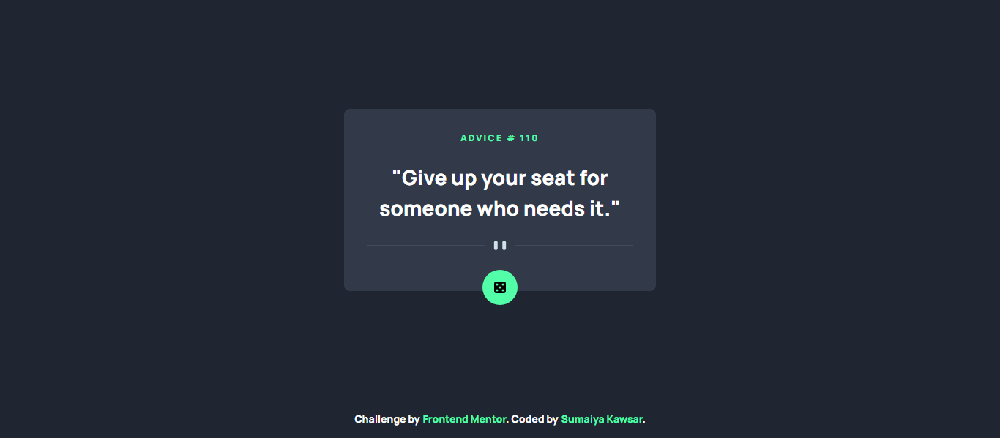

# Frontend Mentor - Advice Generator

  <h3>
    <a href="https://sumaiyakawsar.github.io/sk-advice-generator/">
      Demo
    </a>
     | 
    <a href="https://github.com/sumaiyakawsar/sk-advice-generator">
      Solution
    </a>
     | 
    <a href="https://www.frontendmentor.io/challenges/advice-generator-app-QdUG-13db">
      Challenge
    </a>
  </h3>

## Overview

### The challenge

Users should be able to:
- View the optimal layout for the app depending on their device's screen size
- See hover states for all interactive elements on the page
- Generate a new piece of advice by clicking the dice icon

### Screenshot

### Built with

- [React](https://reactjs.org/) 
- [Tailswind](https://tailwindcss.com/?)
- [Axios](https://axios-http.com/docs/intro)
- [Vite](https://vitejs.dev/)

## My process
 
### What I learned
- Understood how to use useState properly
- Used Vite for the first time

### Continued development
- Open for Suggestions

### Useful resources

## Author

 